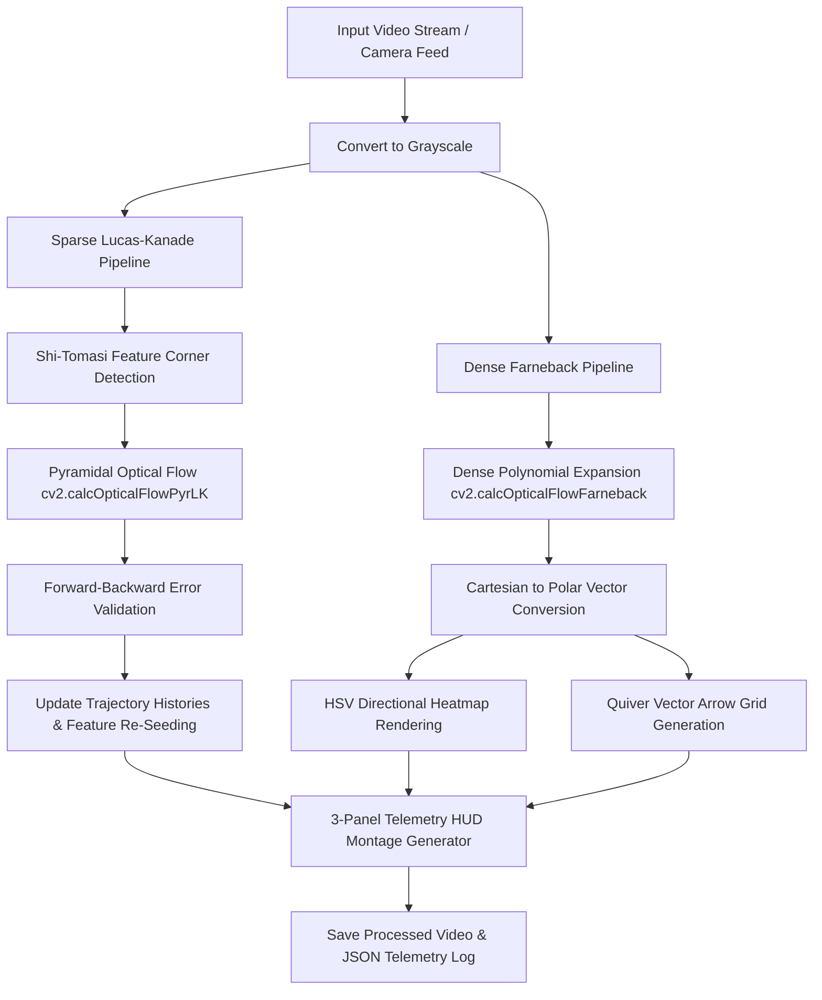

<div align="center">

# 🌀 Optical Flow Motion Vector Tracker

### *Day 09 — 30-Day Computer Vision & Deep Learning Challenge*

[](https://www.python.org/)
[](https://opencv.org/)
[](https://numpy.org/)
[](LICENSE)
[](https://github.com/manasha1232)

*Real-time optical flow motion vector tracker implementing Sparse Lucas-Kanade feature trails, Farneback Dense flow heatmaps, vector quiver grids, and live telemetry dashboards.*

---

</div>

## 📌 Overview

The **Optical Flow Motion Vector Tracker** is a high-performance computer vision solution that analyzes pixel movement between consecutive video frames. It provides motion vector estimation using both **Sparse Lucas-Kanade Optical Flow** (tracking discrete feature points over time) and **Farneback Dense Optical Flow** (computing a dense vector field for every pixel).

### 🎯 Key Capabilities
- **Sparse Lucas-Kanade Pyramidal Flow**:
  - Uses Shi-Tomasi corner detection (`cv2.goodFeaturesToTrack`) to identify salient features.
  - Implements **Forward-Backward Error Validation** to filter out unstable drift points.
  - Features **Dynamic Feature Re-Seeding** when tracked point counts drop below threshold.
  - Renders smooth, fading motion trajectory trails for each active feature point.
- **Farneback Dense Optical Flow Field**:
  - Computes frame-wide motion vectors $(dx, dy)$ for every pixel.
  - Converts Cartesian velocity vectors to Polar coordinates $(\text{Magnitude}, \text{Angle})$.
  - Visualizes direction and speed using an **HSV Motion Heatmap** (Hue = Direction, Value = Velocity) and **Quiver Vector Arrow Grids**.
- **Real-Time 3-Panel HUD Dashboard**:
  - Renders a multi-view telemetry HUD displaying active vector counts, average speed ($\text{px}/\text{frame}$), peak speed, dominant direction, and FPS.
- **JSON Telemetry Log Export**:
  - Exports structured JSON reports containing frame-by-frame velocity statistics, direction distribution, and tracking benchmarks.

---

## 🏗️ System Architecture & Processing Pipeline



---

## 📐 Mathematical Formulation

### 1. Optical Flow Brightness Constancy Constraint
Optical flow assumes that pixel intensities $I(x, y, t)$ remain constant over a small time increment $\delta t$:

$$I(x, y, t) = I(x + \delta x, y + \delta y, t + \delta t)$$

Applying a First-Order Taylor Series expansion yields the **Optical Flow Constraint Equation**:

$$\frac{\partial I}{\partial x} V_x + \frac{\partial I}{\partial y} V_y + \frac{\partial I}{\partial t} = 0 \quad \implies \quad I_x u + I_y v + I_t = 0$$

where $I_x, I_y$ are spatial image gradients, $I_t$ is temporal gradient, and $(u, v)$ is the velocity vector.

### 2. Lucas-Kanade Least Squares Solution
Lucas-Kanade solves the underdetermined equation by assuming constant motion velocity $(u, v)$ in a local $n \times n$ window $\Omega$:

$$\begin{bmatrix} I_x(p_1) & I_y(p_1) \\ I_x(p_2) & I_y(p_2) \\ \vdots & \vdots \\ I_x(p_n) & I_y(p_n) \end{bmatrix} \begin{bmatrix} u \\ v \end{bmatrix} = - \begin{bmatrix} I_t(p_1) \\ I_t(p_2) \\ \vdots \\ I_t(p_n) \end{bmatrix} \quad \implies \quad A \vec{v} = \vec{b}$$

Solving via Least Squares:

$$\vec{v} = (A^T A)^{-1} A^T \vec{b} = \begin{bmatrix} \sum I_x^2 & \sum I_x I_y \\ \sum I_x I_y & \sum I_y^2 \end{bmatrix}^{-1} \begin{bmatrix} -\sum I_x I_t \\ -\sum I_y I_t \end{bmatrix}$$

---

## 📁 Repository Structure

```text
optical_flow_motion_tracker/
├── optical_flow_tracker.py   # Main motion tracker application & 3-panel HUD pipeline
├── generate_demo_video.py    # Synthetic video dataset generator with multi-object motion
├── requirements.txt          # Python dependencies
├── README.md                 # Project documentation
├── input/                    # Input video directory
│   └── sample_motion_video.mp4
└── output/                   # Processed output videos & JSON logs
    ├── sample_motion_video_optical_flow_dual.mp4
    └── sample_motion_video_flow_report.json
```

---

## ⚡ Quickstart & Installation

### 1. Install Dependencies
```bash
pip install -r requirements.txt
```

### 2. Generate Synthetic Benchmark Video
```bash
python generate_demo_video.py
```
*This generates a 150-frame test video featuring bouncing objects, orbiting bodies, and horizontal vehicles in `input/sample_motion_video.mp4`.*

---

## 🚀 Usage Guide

### 1. Process Input Video with 3-Panel HUD (Default)
```bash
python optical_flow_tracker.py --input input/sample_motion_video.mp4 --output output --algorithm dual
```

### 2. Live Webcam Motion Vector Stream
Launch real-time optical flow monitoring via camera:
```bash
python optical_flow_tracker.py --input camera --algorithm dual
```

### 3. Select Specific Algorithm Mode
- **Sparse Lucas-Kanade Only**:
  ```bash
  python optical_flow_tracker.py --input input/sample_motion_video.mp4 --algorithm lk
  ```
- **Dense Farneback Only**:
  ```bash
  python optical_flow_tracker.py --input input/sample_motion_video.mp4 --algorithm dense
  ```

---

## 📊 Telemetry & JSON Output Spec

```json
{
    "video_source": "sample_motion_video",
    "total_frames_processed": 150,
    "total_time_seconds": 19.66,
    "average_fps": 7.6,
    "average_motion_speed_px": 0.27,
    "peak_motion_speed_px": 99.81,
    "output_video": "output/sample_motion_video_optical_flow_dual.mp4"
}
```

---

## 👤 Author & Challenge Context

- **Challenge**: Day 09 of [30-Day Computer Vision & Deep Learning Challenge](https://github.com/manasha1232/30-Day-Computer-Vision-Challenge)
- **Author**: [@manasha1232](https://github.com/manasha1232)
- **License**: MIT License
